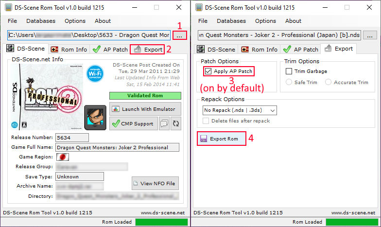

## AP Patching Your Rom

Eugene Pool (the old man on the airship) missing is an anti-piracy measure (among others) by the developers. This can be circumvented by pre-applying an anti-piracy (AP) patch before apply the translation patch. This happens on hardware (DS, 3DS), but not emulation (desume, melonDS).

### Step 1:

Download the RetroGameFan NDS Rom Tool here: `https://gbatemp.net/download/retrogamefan-nds-rom-tool-v1-0_b1215.35735/`

### Step 2:

Extract the program, open the executable, and when open, press the three dots`...` to open your ROM.
When you've opened your ROM, if it says `Validated Rom` inside a green box on the program you can continue.
If there is a orange box with `AP Patched`, you already have a AP patched rom and can skip this process and continue onto patching the translation onto it. Put it inside the `DQM2Pro_Translation-master` folder named `DQMJ2P.nds` ready for translation patching.

### Step 3:

Press the Export tab on the program, ensure `AP Patch` is enabled (it is usually by default) and then press `Export ROM`.
Save the rom as `DQMJ2P.nds` inside your `DQM2Pro_Translation-master` folder, you will need it to be called this to run the patcher.
Make sure none of the other settings are ticked, such as `Trim Garbage`, and `Repack Options` should be set to `No Repack (.nds | .3ds)`.
